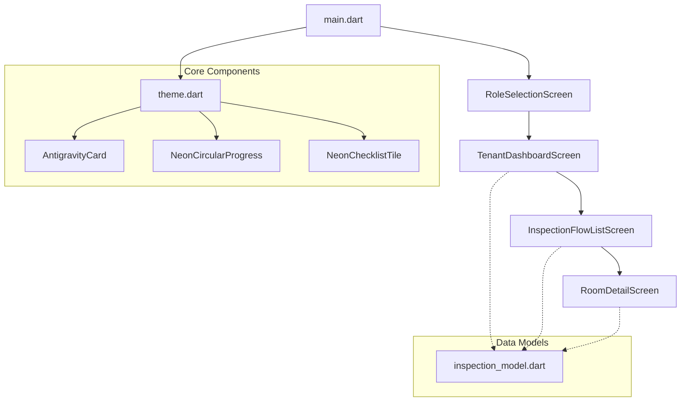

# Implementation Plan - TenantSnap Neo-Futuristic App Front-End

We will build a high-fidelity, premium, neo-futuristic Flutter application called **TenantSnap**. The app's design language is based on **"Neo-Futuristic"** and **"Antigravity"** concepts, featuring a sleek dark cosmic gradient background, glowing neon highlights, lightweight floating glassmorphic cards, and tactile emoji-based rating selectors.

---

## User Review Required

Please review the proposed design decisions, architectural components, and screen navigation flows.

> [!IMPORTANT]
> - **Platform Customization**: The theme and styles will be optimized for a dark-mode mobile layout (both Android and iOS). 
> - **Font Asset Handling**: Since we are setting up a clean layout, we will use modern system geometric fonts or standard sans-serif configurations in Flutter (with fallback configuration) to ensure zero asset-loading errors, while designing them to feel geometric and futuristic.
> - **State Management**: For this phase, we will implement interactive state using Flutter's built-in stateful widgets and standard callback architecture, which makes the prototype fully functional and interactive immediately. In the follow-up section, we will detail how to upgrade this to Riverpod/BLoC.

---

## Proposed Changes

We will construct a structured, clean, and modular codebase. All project files will reside in the `lib` folder of the new Flutter project.

### 1. Project Initialization

#### [NEW] [pubspec.yaml](file:///c:/webflow/tenent/pubspec.yaml)
We will define dependencies:
- `cupertino_icons` for elegant system iconography.
- We will configure custom packages if needed (e.g., Google Fonts or standard typography) or use robust geometric fallback configurations to avoid external dependency download blocks.

### 2. Design System & Theme

#### [NEW] [theme.dart](file:///c:/webflow/tenent/lib/theme.dart)
This will contain all our premium visual assets and style definitions:
- **Colors**:
  - `primaryColor`: Deep Cosmic Blue (`0xFF0B0D1B`)
  - `accentColor`: Electric Teal (`0xFF00F2FE`)
  - `roleColorTenant`: Radiant Cyan (`0xFF00E5FF`)
  - `roleColorLandlord`: Glowing Amber/Orange (`0xFFFF9100`)
  - `bgGradient`: LinearGradient from Deep Navy Blue (`0xFF0D1127`) to Cosmic Dark Violet (`0xFF1B0B2E`).
- **Typography**: Geometric sans-serif styled text themes utilizing wide spacing, varying font weights (w300 light, w500 medium, w700 bold), and subtle neon text shadow glow effects for headers.
- **Core Custom Widgets**:
  - **`AntigravityCard`**: A glassmorphic card widget with a semi-transparent cosmic background, a very thin high-contrast neon border (with glowing box shadows), and rounded corners (e.g., 20px radius).
  - **`NeonCircularProgressIndicator`**: A custom painter-based circular progress indicator that renders a beautiful neon glowing gradient line instead of the basic default spinner.

### 3. Application Components & Screens

#### [NEW] [inspection_model.dart](file:///c:/webflow/tenent/lib/models/inspection_model.dart)
A dummy data model containing:
- Room properties: `id`, `name`, `number`, `icon`, `progress` (percentage), `isCompleted`, and checklist items.
- Checklist item structure: `name`, `status` (`happy`, `sad`, `neutral`), and list of images (dummy paths).

#### [NEW] [main.dart](file:///c:/webflow/tenent/lib/main.dart)
The main entry point. Sets up the dark material theme, background gradient layout, and navigation routes.

#### [NEW] [role_selection_screen.dart](file:///c:/webflow/tenent/lib/screens/role_selection_screen.dart)
- **Visual Features**: Full background gradient, stars or cosmic dust elements.
- **Header**: High-fidelity TenantSnap logo placeholder (neon glowing emblem) and stylized text.
- **Center**: Two large circular glowing buttons representing the Tenant and Landlord roles. Tapping them toggles active glow states.
- **Bottom**: Geometric "New Registration" (outlined glass button) and "Sign In" (solid teal glow button) navigating directly to the Tenant Dashboard.

#### [NEW] [tenant_dashboard_screen.dart](file:///c:/webflow/tenent/lib/screens/tenant_dashboard_screen.dart)
- **Profile Header**: Avatar of Liam, status label, and a neon notification bell badge.
- **Notification Bar**: Slide-in floating banner highlighting the "Upcoming Inspection".
- **Actions Grid**: A 2x2 grid of action items (Start New Inspection, Active Inspections, History & Reports, Profile & Support) built with the glassmorphic `AntigravityCard`.
- **Interactions**: Tapping "Start New Inspection" navigates to the list screen, passing the default dummy state.

#### [NEW] [inspection_flow_list_screen.dart](file:///c:/webflow/tenent/lib/screens/inspection_flow_list_screen.dart)
- **Header**: "START INSPECTION FLOW" with hexagonal visual steps indicator.
- **Room List**: A dynamic scrollable list of rooms (Entry/Mudroom, Living Room, Kitchen, Bathroom, etc.).
- **Visual States**: The active room (e.g., Kitchen) will feature a thicker glowing cyan/teal border and a highlighted 90% progress indicator, while inactive or completed rooms show normal status (e.g., 70% or 100%).
- **Navigation**: Tapping a room navigates to the specific checklist screen for that room.
- **Footer**: Neo-futuristic navigation buttons (Back, Next Step).

#### [NEW] [room_detail_screen.dart](file:///c:/webflow/tenent/lib/screens/room_detail_screen.dart)
- **Header**: Back button, neon title (`5. Kitchen` or similar room name).
- **Tactile Checklist**: List of inspection categories (Ceiling, Walls, Floor/Carpet/Tiles, Doors, Closets, Shelving, Windows, Light Fixtures, Outlets). Each item displays a 3-way toggle based on the actual screenshot:
  - 😄 Happy face (Satisfactory condition)
  - 😟 Sad face (Needs attention)
  - ➖ Neutral line (Not applicable / untested)
- **Photo Feed Section**:
  - A large neon '+' button.
  - Horizontal or grid layout of added photos showing timestamp and coordinate overlays in glowing overlays.
- **Comment box**: Multi-line dark glassmorphic input box.
- **Action Button**: Large glowing "GENERATE REPORT" button that aggregates local states and simulates compilation.

---

## Verification Plan

### Automated / Diagnostic Checks
1. **Compilation Check**: Run `flutter build apk` or check for compilation issues using analyzer checks: `flutter analyze`.
2. **Layout & Overflow checks**: Build the screens inside a ScrollView where applicable to ensure zero rendering overflows on smaller screen sizes.

### Manual Verification Flow
We will provide a interactive step-by-step walkthrough in the final document:
1. **Role Select**: Click through Tenant/Landlord options, and verify the glowing toggles. Click "Sign In" to proceed.
2. **Dashboard**: Verify Liam's profile header, the upcoming inspection banner, and the 2x2 action cards with progress meters. Tap "Start New Inspection".
3. **Room List**: Check that the current active room stands out visually with custom neon borders. Tap on a room (e.g. Kitchen) to open details.
4. **Kitchen Details**: Interact with the smiley rating toggles, tap "+" to simulate adding photo items (which will dynamically add dummy photos to the grid), type a comment, and tap "Generate Report" to see an animated report generation overlay.
